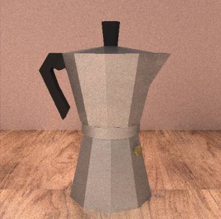

# Proyecto de programación gráfica

## Integrantes

- Carmen Irene Cabrera Rodríguez C-412
- Enrique Martínez González C-412

### Imagen original

### Imagen producida usando raytracing

### Imagen producida usando pathtracing

## Implementación

### Modelación de la cafetera

Para modelar la estructura de la cafetera se utilizó la clase `Mesh` ya dada. Se crearon diferentes *mesh* en dependencia del material utilizado, y a su vez, por cada material, se dividió por partes diferentes de la cafetera; la distribución se hizo de la siguiente forma:

- Parte de plástico:
  - Asa de la cafetera
  - Tirador de la tapa
- Parte de metal:
  - La base o el depósito inferior
  - La parte superior (el colector del café)
  - La rosca (la unión entre la base y la parte superior)
  - La tapa
- Válvula

Para trabajar con mayor comodidad con diferentes *mesh* se implementaron las funciones `Add_Mesh` y `Bigger_Mesh` que permiten unificar un conjunto de *mesh* en una sola. De este modo, para cada parte específica enumerada anteriormente, se genera su *mesh* y utilizando dichas funciones se puede retornar el *mesh* que representa a cada material.

#### Construcción de las figuras

Para construir la mayoría de las partes de la cafetera se aplicó la siguiente idea:

Dado un punto `C` y un radio `r`, construir un polígono regular de `n` lados con centro en `C` y siendo `r` la distancia entre el centro y cada uno de los vértices. Dados dos polígonos construidos de esta forma, con la misma cantidad de lados

### Materiales y sus parámetros

La textura del plástico, así como la de la pared se modelaron directamente seleccionando un color. Mientras, la del metal de la cafetera, la válvula y la mesa