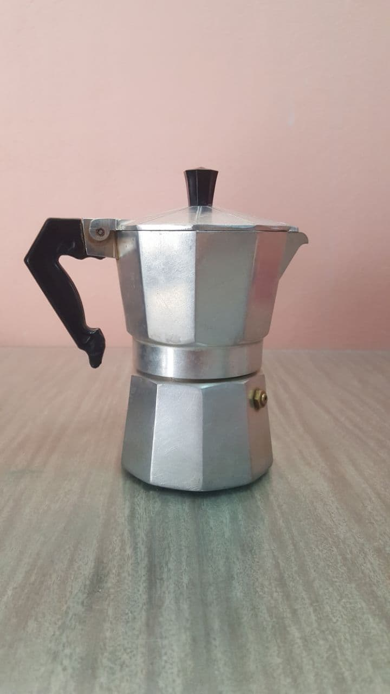
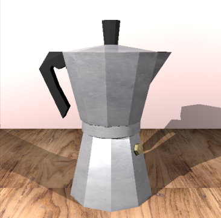

# Proyecto de programación gráfica

## Integrantes

- Carmen Irene Cabrera Rodríguez C-412
- Enrique Martínez González C-412

### Imagen original

### Imagen producida usando raytracing

### Imagen producida usando pathtracing

## Implementación

### Modelación de la cafetera

Para modelar la estructura de la cafetera se utilizó la clase `Mesh` ya dada. Se crearon diferentes *mesh* en dependencia del material, y a su vez, por cada material, se dividió por partes diferentes de la cafetera; la distribución se hizo de la siguiente forma:

- Parte de plástico:
  - Asa de la cafetera
  - Tirador de la tapa
- Parte de metal:
  - La base o el depósito inferior
  - La parte superior (el colector del café)
  - La rosca (la unión entre la base y la parte superior)
  - La tapa
- Válvula

Para trabajar con mayor comodidad con diferentes *mesh* se implementaron las funciones `Add_Mesh` y `Bigger_Mesh` que permiten unificar un conjunto de *mesh* en una sola. De este modo, para cada parte específica enumerada anteriormente, se genera su *mesh* y utilizando dichas funciones se puede retornar el *mesh* que representa a cada material.

#### Construcción de las figuras

La idea fundamental para la construcción de cada sección de la cafetera fue la siguiente:

Dado un punto `C` y un radio `r`, construir un polígono regular de `n` lados con centro en `C` y siendo `r` la distancia entre el centro y cada uno de los vértices. Dados dos polígonos construidos de esta forma, con la misma cantidad de lados, si se une con una línea los vértices homólogos de las figuras se puede obtener una sección de la cafetera. Para obtener la malla de una sección de este tipo se utilizó la función `CoffeMakerSection_Mesh` que recibe los puntos de ambos polígonos.

Igualmente, la función `Mesh_Poliedro` permite construir una malla dado un polígono, como los descritos, y un punto. Así se generó, por ejemplo, la tapa de la cafetera o la superficie de la válvula.

### Materiales y sus parámetros

La textura del plástico, así como la de la pared se modelaron directamente seleccionando un color. Mientras, la del metal de la cafetera, la válvula y la mesa se consiguieron a través del mapeo de imágenes (que puede encontrar en la carpeta del proyecto).

La textura del metal de la cafetera se puede apreciar mejor en la imagen obtenida del *raytracing*. En este caso se puso un valor de *specular* alto, y el *diffuse* de un gris claro. Sin embargo, en el caso del *pathtracing*, con estos parámetros se observaba demasiado brillante la imagen; por tanto, se disminuyeron ambos valores (en el caso del *diffuse*, para un gris más oscuro).

### Múltiples luces

Para implementar múltiples luces, por cada luz dada, se ejecuta el algoritmo y se suman los *radiance* obtenidos.

En particular se ubicaron dos luces, una a cada lado de la cafetera, y una más cercana que la otra; lo que implica que una de las sombras es más corta y también más oscura. Estos detalles pueden ser observados en la imagen que retorna el algoritmo de *raytracing*.

En el caso del algoritmo de *pathtracing*, cuyo resultado se muestra en la otra imagen, las luces se tomaron como esferas de radio 10, las cuales simulan la luz ambiental.

> El resto del código fue el recibido durante las clases, con ligeras modificaciones para corresponder con el modelo de la cafetera.